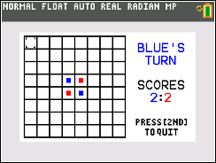

# Games For TI-84 Plus CE
This repo contains a collection of games I made on a TI-84 Plus CE graphing calculator.  
I had a lot of fun learning the TI-BASIC programming language and building these games!

## Snake
  
The classic game of snake. You can toggle whether or not wrapping around the screen is allowed in the options. Also features a leaderboard that remembers your highscores even after you exit the game.

## Connect 4
  
Connect 4 features a 2 player mode as well as a 1 player mode where you can play against an AI.

## Reversi
  
Also known as Othello. Play against a friend and see who can flip more disks to their colour by the end. (Note: if you end up in a situation where one player can't move, you can press [ALPHA] to pass the turn over)

## Pokemon
  
The most complex game I recreated, and the one I am proudest of. Battle against a friend using Red's classic team of 6 pokemon. Status conditions, stat changes, priority moves and numerous other features have also been implemented.  

Never have I ever been more appreciative of objects, functions, variables with actual names and other typical programming language features than after building this game on a calculator...

## How to Play
If you have a TI-84 Plus CE, you can try playing these games yourself!
1. Download the [TI Connect CE](https://education.ti.com/en/products/computer-software/ti-connect-ce-sw) software
2. Connect your TI-84 Plus CE calculator to your computer
3. Copy all the ".8xp" and ".8xl" files to your calculator using the software
4. Press the [PRGM] button and select the correct program whose name matches the name of the game (the other programs are just helper subroutines to support the main program)
5. Press [ENTER] and enjoy the game!